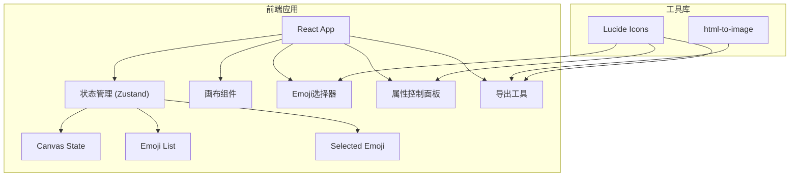

## 1. 架构设计



## 2. 技术描述

- **前端**：React@18 + TypeScript + TailwindCSS@3 + Vite
- **初始化工具**：vite-init
- **状态管理**：Zustand
- **图标库**：lucide-react
- **图片导出**：html-to-image
- **后端**：无（纯前端应用）
- **数据库**：无（本地状态）

## 3. 路由定义

| 路由 | 用途 |
|------|------|
| / | 主页面 - Emoji合成器 |

## 4. 数据模型

### 4.1 Emoji元素数据结构

```typescript
interface EmojiItem {
  id: string;
  emoji: string;
  x: number;
  y: number;
  scale: number;
  rotation: number;
  zIndex: number;
}
```

### 4.2 画布状态

```typescript
interface CanvasState {
  emojis: EmojiItem[];
  selectedId: string | null;
  history: EmojiItem[][];
  historyIndex: number;
  canvasSize: { width: number; height: number };
}
```

## 5. 组件结构

```
src/
├── components/
│   ├── EmojiPicker/       # Emoji选择器组件
│   │   ├── EmojiPicker.tsx
│   │   └── EmojiCategory.tsx
│   ├── Canvas/            # 画布组件
│   │   ├── Canvas.tsx
│   │   └── CanvasEmoji.tsx
│   ├── ControlPanel/      # 控制面板
│   │   ├── ControlPanel.tsx
│   │   └── SliderControl.tsx
│   └── Toolbar/           # 工具栏
│       └── Toolbar.tsx
├── hooks/
│   ├── useCanvasStore.ts  # 画布状态管理
│   └── useDrag.ts         # 拖拽逻辑
├── utils/
│   ├── emojiData.ts       # Emoji数据
│   └── exportImage.ts     # 导出图片工具
├── pages/
│   └── Home.tsx
├── App.tsx
└── main.tsx
```

## 6. 核心功能实现方案

### 6.1 拖拽实现
- 使用鼠标事件 (mousedown/mousemove/mouseup)
- 计算鼠标偏移量，实时更新位置
- 支持触摸事件兼容移动端

### 6.2 缩放与旋转
- 选中元素显示控制手柄
- 拖拽角手柄调整大小
- 拖拽顶部手柄旋转
- 控制面板提供精确数值调整

### 6.3 图片导出
- 使用 html-to-image 库将DOM转为PNG
- 生成图片后调用 Clipboard API 复制
- 支持下载到本地

### 6.4 历史记录
- 操作前保存状态快照到历史栈
- 支持撤销/重做
- 限制最大历史记录条数
