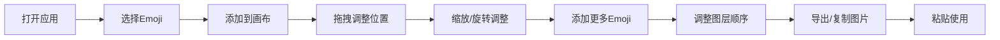

## 1. 产品概述

Emoji合成器是一个创意工具，允许用户自由组合多个Emoji表情，通过拖拽、缩放、旋转调整位置和大小，生成独特的新表情图片，并支持一键复制到剪贴板直接使用。

- 主要用途：创作个性化Emoji表情，用于社交聊天、表情包制作、创意设计
- 目标用户：社交达人、表情包爱好者、创意工作者
- 产品价值：零门槛的创意表达工具，让每个人都能轻松制作专属Emoji

## 2. 核心功能

### 2.1 功能模块

1. **主画布区**：可视化编辑画布，展示当前合成的Emoji组合
2. **Emoji选择器**：分类展示常用Emoji，点击添加到画布
3. **属性控制面板**：调整选中Emoji的位置、大小、旋转角度、层级
4. **导出工具栏**：生成图片、复制到剪贴板、清空画布、撤销操作

### 2.2 页面详情

| 页面名称 | 模块名称 | 功能描述 |
|---------|---------|---------|
| 首页 | 顶部标题区 | 品牌Logo、副标题说明、主题切换 |
| 首页 | Emoji选择器 | 分类标签、Emoji网格、搜索过滤 |
| 首页 | 主画布区 | 可拖拽画布、选中高亮、多图层管理 |
| 首页 | 属性控制面板 | 位置XY、缩放比例、旋转角度、前后层级 |
| 首页 | 底部工具栏 | 导出PNG、复制图片、清空、撤销、重做 |

## 3. 核心流程

用户打开应用 → 从Emoji选择器中点击添加Emoji到画布 → 拖拽调整位置 → 使用滑块或手柄调整大小和旋转 → 可继续添加更多Emoji叠层 → 点击导出/复制按钮 → 生成的图片自动复制到剪贴板 → 可直接粘贴使用

## 4. 用户界面设计

### 4.1 设计风格

- **设计基调**：俏皮活泼、创意玩具感、圆润柔和
- **主色调**：柔和渐变粉紫色背景，搭配明亮的彩虹色系点缀
- **辅助色**：鹅黄色、薄荷绿、天空蓝，用于按钮和交互元素
- **按钮风格**：圆润胶囊形按钮，带柔和阴影和悬停放大效果
- **字体**：圆润可爱的展示字体 + 现代无衬线正文字体
- **布局风格**：三栏布局，左侧Emoji选择器、中间画布、右侧属性面板
- **卡片风格**：半透明玻璃态卡片，带模糊背景效果
- **动效**：弹性动画、柔和过渡、微交互反馈

### 4.2 页面设计概述

| 页面名称 | 模块名称 | UI元素 |
|---------|---------|--------|
| 首页 | 顶部标题 | 渐变文字Logo、副标题、主题切换按钮 |
| 首页 | Emoji选择器 | 分类标签栏、搜索框、Emoji网格（大尺寸展示）、滚动容器 |
| 首页 | 主画布 | 虚线边框画布、网格背景、选中高亮描边、拖拽手柄、旋转手柄 |
| 首页 | 属性面板 | 数值滑块、数字输入框、图层列表、上下移动按钮 |
| 首页 | 底部工具栏 | 图标按钮组、主操作按钮（复制/导出）、清空按钮 |

### 4.3 响应式

- 桌面端：三栏布局，固定画布尺寸
- 平板端：左右面板可折叠，画布居中
- 移动端：单栏布局，选择器和面板改为底部抽屉式
- 触控优化：加大触控区域，支持双指缩放

### 4.4 交互细节

- Emoji添加到画布时有弹跳入场动画
- 拖拽时带轻微阴影跟随效果
- 选中Emoji时有呼吸发光效果
- 滑块调整实时预览变化
- 复制成功后有成功提示动效
- 按钮悬停有缩放和颜色渐变
